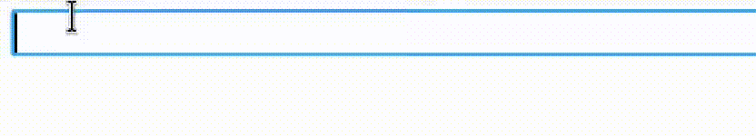

# digraphs
A browser extension that allows you to type most characters without switching keyboard layouts.
To enter a digraph, you press a shorcut (Ctrl-K by default) and a combination of two keys.
This extension also allows you to define custom digraphs.

## Settings documentation

### Enable
Enables/disables digraph entering for a given site.
### Display prompt
Enables/disables displaying the prompt (?) when entering a digraph on the given site.
Use this when this extension is causing problems on a particular site.
### Shortcut
Change the shortcut that triggers the digraph.

## License
`digraphs` is licensed under the MIT license.
